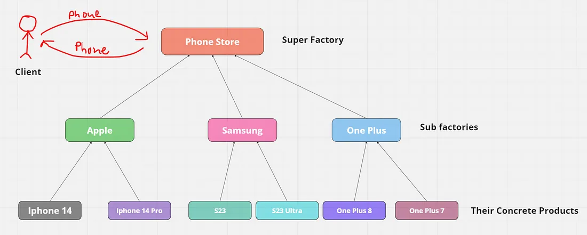

It uses composition
Complete Code - https://medium.com/@akshatsharma0610/abstract-factory-design-pattern-in-java-45a326c8fc9f#:~:text=The%20factory%20method%20is%20just,handle%20the%20desired%20object%20instantiation.

Nice Understanding on the difference between abstract factory and factory
https://www.linkedin.com/pulse/factory-abstract-pattern-amit-nadiger/

*** Factory Class returns the Type for Abstract Factory Design Pattern
* Factory Class returns the Object for Factory Design Pattern**

**Differences between Factory and Abstract Factory**
====================================================
One of the main differences between Factory and Abstract Factory patterns is the level of
abstraction. The Factory pattern deals with creating objects of a single type,
while the Abstract Factory pattern deals with creating objects of related types.
The Factory pattern is simpler and more flexible, but the Abstract Factory pattern is
more robust and consistent. Another difference is the number of classes involved.
The Factory pattern usually has one Factory class and one interface for the products,
while the Abstract Factory pattern has one Abstract Factory interface,
multiple concrete Factory classes, and multiple interfaces for the products.
The Factory pattern is easier to implement and maintain,
but the Abstract Factory pattern is more scalable and extensible.

**When to use Abstract Factory Design Pattern**
----------------------------------------------
The Abstract Factory pattern should be used when creating objects of related types, 
and you want to ensure they are compatible. It is also beneficial for abstracting the 
creation of the objects from client code, and allowing multiple families of products to 
be switched at runtime. 

When you want to create families of related objects, such as different types of products that 
need to work together.