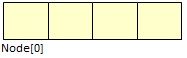
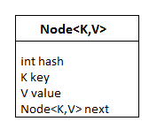
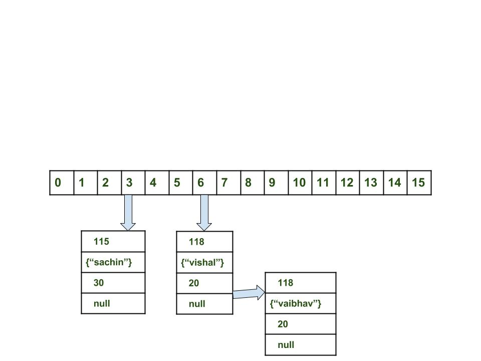

**Hash Map Notes**
==================
* HashMap never allows duplicate keys
* It replaces the value on duplicate keys but duplicate values are allowed
* we can put null as key,NULL or "null" are not null
* Elements are not ordered , any order elements can be printed.
* Not thread safe
* HashCode for Null is 0
  
For thread safety you can use concurrent hashmap

  **Time and Space Complexity**
  =============================
  
  HashMap provides constant time complexity for basic operations, get and put if the hash function is properly written and it 
  disperses the elements properly among the buckets. Iteration over HashMap depends on the capacity of HashMap and the number of key-value pairs. 
  Basically, it is directly proportional to the capacity + size. Capacity is the number of buckets in HashMap. 
  So it is not a good idea to keep a high number of buckets in HashMap initially.

**Performance of HashMap**
The performance of HashMap depends on 2 parameters which are named as follows:

Initial Capacity-By default 16 key pairs can be stored
Load Factor - In java, it is 0.75f by default, meaning the rehashing takes place after filling 75% of the capacity.

**Synchronized HashMap**
Map m = Collections.synchronizedMap(new HashMap(...));

**Fail Safe and Fail Fast In Iterator**

Fail Safe - During iteration modify the keys values will not throw exception.Using **Concurrent hashmap** and  **CopyOnWriteArrayList** this can be achieved.

Fail Fast - During iteration modify the keys values will throw exception.

**Internal Structure of HashMap**
internally ashman uses array of buckets and indexing.
Internally HashMap contains an array of Node and a node is represented as a class that contains 4 fields:

int hash
K key
V value
Node next
It can be seen that the node is containing a reference to its own object. So it’s a linked list.

HashMap:

node hash map

**How Hash Map works in Java**
1. Create hashcode for the key lets say 118
2. Calculate index using hashcode and n-1 formulae - lets say 6
3. if at the index any existing value is found then use hashcode and equals if both keys are same?
4. If keys are the same, replace the value with the current value else use the same index and store 2 values 
    like below 

**Hashing:**
When you add a key-value pair to the HashMap using the put method, the HashMap class computes the hash code of the key. 
It then uses this hash code to determine the index of the bucket where the key-value pair should be stored in the array. 
Hashing is a technique of generating the hashcode of the object. To achieve this hashCode() method is used. hashCode() 
method of the object class returns the memory reference of an object in integer form. This hash code determines the index within an 
array called the bucket, where the value will be stored. In the above example hascode for book was “B”.

