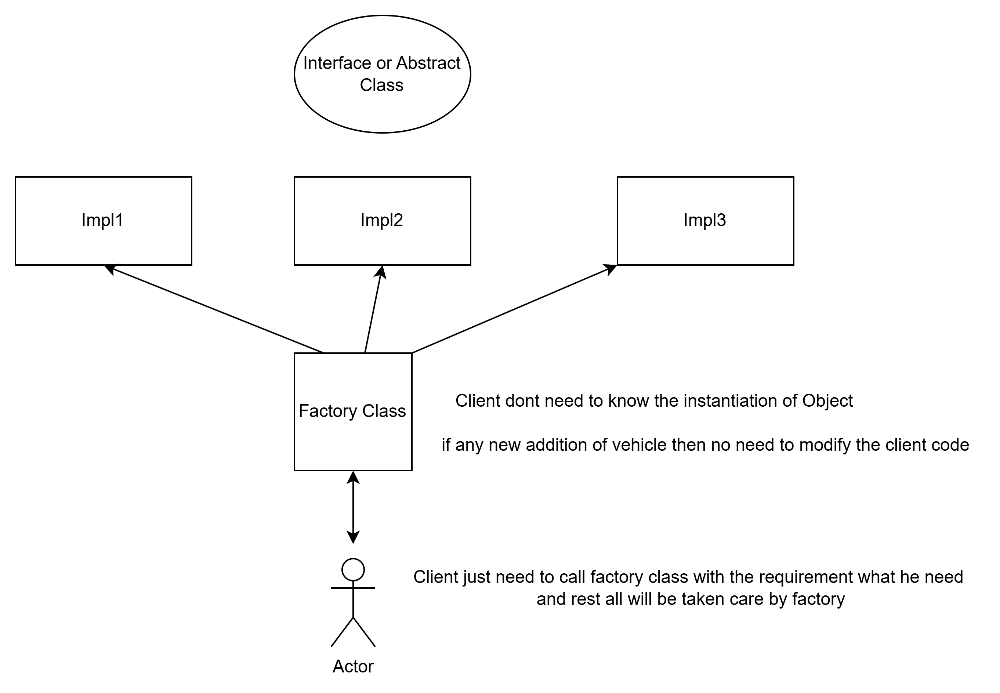

it uses inheritance
Complete Code - https://medium.com/@akshatsharma0610/abstract-factory-design-pattern-in-java-45a326c8fc9f#:~:text=The%20factory%20method%20is%20just,handle%20the%20desired%20object%20instantiation.
(change to factory design Pattern)

Nice Understanding on the difference between abstract factory and factory
https://www.linkedin.com/pulse/factory-abstract-pattern-amit-nadiger/

**Advantages of Factory Design Pattern**

* Loose Coupling
* Enhanced Code Reusability - This reduces code duplication and improves maintainability.
* Flexibility and Extensibility - It supports the open-closed principle, 
                                  as new products can be added without modifying existing client code.
* Encapsulation of Object Creation - Object Creation is in factory only so encapsulated from everywhere.

* Factory Class returns the Type for Abstract Factory Design Pattern
* Factory Class returns the Object for Factory Design Pattern

**Differences between Factory and Abstract Factory**
====================================================
One of the main differences between Factory and Abstract Factory patterns is the level of
abstraction. The Factory pattern deals with creating objects of a single type,
while the Abstract Factory pattern deals with creating objects of related types.
The Factory pattern is simpler and more flexible, but the Abstract Factory pattern is
more robust and consistent. Another difference is the number of classes involved.
The Factory pattern usually has one Factory class and one interface for the products,
while the Abstract Factory pattern has one Abstract Factory interface,
multiple concrete Factory classes, and multiple interfaces for the products.
The Factory pattern is easier to implement and maintain,
but the Abstract Factory pattern is more scalable and extensible.

**When to use Factory Pattern**
===============================
The Factory pattern should be used when you only need to create objects of a single type and wish
to conceal the logic of their creation from the client code. 

When you want to create objects of a single type, but you want to decouple the client code from the specific implementation details of the object creation process.