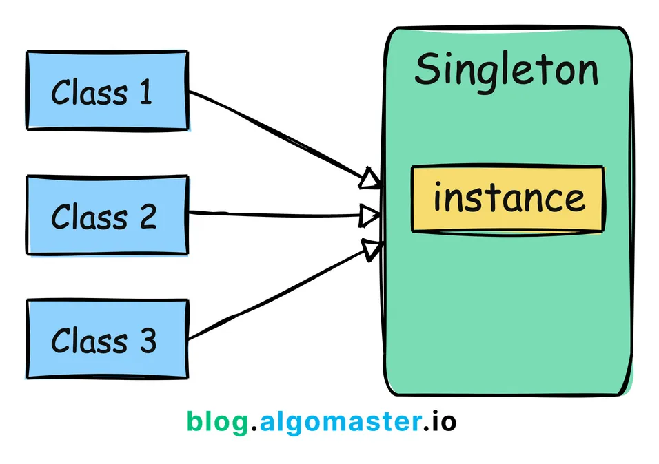

**What is Singleton Design Pattern(Creational Design Pattern)?**
=====================================
Singleton Pattern is a creational design pattern that guarantees a class has only one 
instance and provides a global point of access to it.

It involves only one class which is responsible for instantiating itself, 
making sure it creates not more than one instance.

**How to Identify 2 instances are different to each Other**
------------------------------------------------------------

Hashcode for each instances will be different
